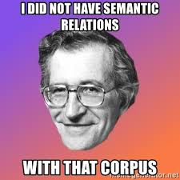

# PyTextRank

**PyTextRank** is a Python implementation of *TextRank* as a
[spaCy pipeline extension](https://spacy.io/universe/project/spacy-pytextrank),
for graph-based natural language work -- and related knowledge graph practices.
This includes the family of [*textgraph*](glossary/#textgraphs) algorithms:

  - *TextRank* by [[mihalcea04textrank]](biblio/#mihalcea04textrank)
  - *PositionRank* by [[florescuc17]](biblio/#florescuc17)
  - *Biased TextRank* by [[kazemi-etal-2020-biased]](biblio/#kazemi-etal-2020-biased)
  - *TopicRank* by [[bougouin-etal-2013-topicrank]](https://derwen.ai/docs/ptr/biblio/#bougouin-etal-2013-topicrank)

Popular use cases for this library include:

  - *phrase extraction*: get the top-ranked phrases from a text document
  - low-cost *extractive summarization* of a text document
  - help infer concepts from unstructured text into more structured representation

The *entity linking* aspects here are a *work-in-progress*, based on
[`kglab`](https://github.com/DerwenAI/kglab).

## Cut to the Chase

  1. To get started right away, jump to [*Getting Started*](start/)
  1. For a hands-on coding tour through **pytextrank**, see the [*Tutorial*](tutorial/) notebooks
  1. Check the source code at <https://github.com/DerwenAI/pytextrank>

## Motivations

Some modifications in **PyTextRank** attempt to improve on the base
algorithm as originally described in
[[mihalcea04textrank]](biblio/#mihalcea04textrank):

  - fixed a bug: see [Java impl, 2008](https://github.com/ceteri/textrank)
  - use *lemmatization* in place of out-dated stemming
  - integration with `spaCy` as a pipeline component factory
  - simple *extractive summarization* based on vector distance from ranked phrases
  - leverage preprocessing via *noun chunking* and *named entity recognition*
  - optionally, include verbs in the graph (although not in the resulting ranked phrases)

The use of *graph algorithms* within natural language work -- 
notably, through
[*eigenvector centrality*](glossary/#eigenvector-centrality)
-- helps provide a more flexible and robust basis for integrating
additional AI techniques.
There have been many amazing innovations since late 2017 
in the application of *deep learning* for
[*language models*](glossary/#language-model).
Most certainly these kinds of DL models get leveraged by
**PyTextRank**, within `spaCy` 3.x during the earlier stages of
processing.
However, using transformers and related DL models throughout *all* of
the NLP pipeline stages -- while popular -- also tends to imply
certain trade-offs:

  * emphasis on predictive power for recognizing sequences
  * models which require substantial resources to train, deploy, etc.
  * relatively opaque models
  * large carbon footprint
  * disjoint from leveraging domain expertise

Our experience with *textgraphs* is this category of algorithms
provides computationally efficient methods that do not require
substantial training in advance, which can import and leverage 
domain expertise.

Moreover, this approach can be integrated downstream in *knowledge
graph* use cases through *embedding* methods (deep learning) for
complementary, hybrid AI solutions.

## Community Resources

Links for other open source community resources:

  * [Issue Tracker](https://github.com/DerwenAI/pytextrank/issues)
  * [Project Board](https://github.com/DerwenAI/pytextrank/projects/1)
  * [Milestones](https://github.com/DerwenAI/pytextrank/milestones)
  * [spaCy uniVerse](https://spacy.io/universe/project/spacy-pytextrank)

Other good ways to help troubleshoot issues:

  - search [related discussions on StackOverflow](https://stackoverflow.com/search?q=pytextrank)
  - tweet to `#textrank` on [Twitter](https://twitter.com/search?q=%23textrank) (cc `@pacoid`)

The [Knowledge Graph Conference](glossary/#knowledge-graph-conference)
hosts several community resources where you can post questions and 
get help about **pytextrank** and related
[KG](glossary/#kg)
topics.

  * [community Slack](https://knowledgegraphconf.slack.com/ssb/redirect) – specifically on the `#ask` channel
  * [*Graph-Based Data Science*](https://www.linkedin.com/groups/6725785/) group on LinkedIn – join to receive related updates, news, conference coupons, etc.

For related course materials and training, please check for calendar
updates in the article
["Natural Language Processing in Python"](https://medium.com/derwen/natural-language-processing-in-python-832b0a99791b).
