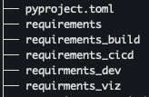
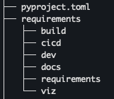

# Simple worked example of pip-tools

# Table of Contents

1. [Overview](#overview)
2. [Requirements .IN and .TXT](#requirements-in-and-txt)
3. [Requirements-Viz .IN and .TXT](#requirements-viz-in-and-txt)
4. [Generating and Comparing the .TXT Files](#generating-and-comparing-the-txt-files)
    1. [Initial Requirements .TXT Files](#initial-requirements-txt-files)
    2. [Generating the NEW .TXT Files](#generating-the-new-txt-files)
    3. [Comparing the .TXT and NEW TXT Files](#comparing-the-txt-and-new-txt-files)
6. [Notes and Thoughts](#notes-and-thoughts)

## Overview

## Requirements .IN and .TXT 

initial requirements.in file
Differences from current requirements.txt - no version on networkx
Changes for comparison requirements.in
> Updated spacy version spacy >= 3.0 to spacy >= 3.1

```requirements.txt
# requirements.in
# graphviz >= 0.13
graphviz>=0.13
# icecream >= 2.1
icecream>=2.1
# networkx[default] >= 2.6
networkx[default]
# pygments >= 2.7.4
pygments>=2.7.4
# scipy >= 1.7
scipy>=1.7
# spacy >= 3.0
spacy>=3.0
```

```requirements.txt
# requirements.in to generate new_requirements.txt for example
# As Above
# Update Spacy Version new_requirements.in
spacy>=3.1
```

### Requirements-Viz .IN and .TXT

Used the requirements-vix.in file to generate the requirements_viz.txt file.
Used the layering of requirements_viz.in files to generate the requirements_viz.txt file.
I did not specify the version of altair in the requirements_viz.in file.

```requirements.txt
# requirements_viz.in
# Use requirements.txt
-c requirements.txt
#altair >= 4.1.0
altair
```

### Generating and Comparing the .TXT Files 

#### Initial Requirements .TXT Files 
- requirements.txt
- requirements_viz.txt files

```bash
pip-compile --generate-hashes --output-file requirements.txt requirements.in
```

```bash
pip-compile --generate-hashes --output-file requirements_viz.txt requirements_viz.in
```

#### Generating the NEW .TXT Files
- new_requirements.txt
- new_requirements_viz.txt

```bash
pip-compile --generate-hashes --output-file new_requirements.txt new_requirements.in
```

```bash
pip-compile --generate-hashes --output-file new_requirements_viz.txt new_requirements_viz.in
```

### Comparing the .TXT and NEW TXT Files
- requirements.txt
- new_requirements.txt files

```bash
sdiff -s requirements.txt new_requirements.txt | tee check_diff_requirements.txt
```
- requirements-viz.txt
- new_requirements-viz.txt

```bash
sdiff -s requirements_viz.txt new_requirements_viz.txt | tee check_diff_requirements_viz.txt
```

# Notes and Thoughts

## Can support other important parts of the project

* precommit-hooks
* pyproject.toml
* non setuptools based project/build

## Process Impact

Small changes to the process are likley
I thinkThat we could potentially simplifey the process and automate parts to have minimal impact and overhead.

As a example, we could have a Makefile that would manage the pip-tools commands and differences checking.

We might want to change the project directory structe and create requirements directories either in the project root or
a parent requirements directory.

### Project Directory
#### Requirements Directories in Project Root



#### Requirements Directories in Parent Requirements Directory




